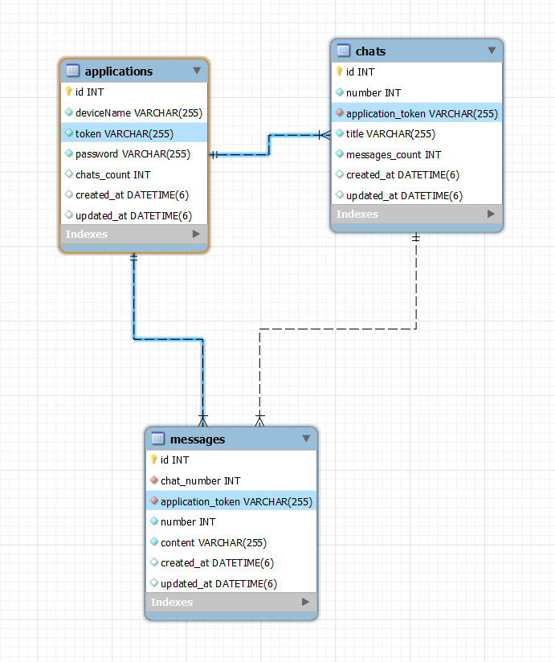
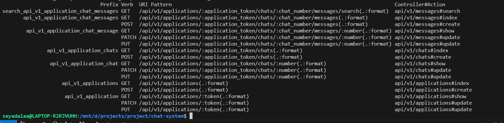

# README

## Chat system API Endpoint (Ruby on Rails)

### Git Workflow
Used Feature Branch Workflow which helped me manage code changes by isolating new features in seperate branches, squaching commits for clarity and merging cleanly into main branch.

### Designs
#### System Design Diagram


#### Database Design


Note: Database in utf8 to support Arabic

Relations:

* Applications Table:

  - > 1 to many relation with Chats table.

  - > 1 to many relation with Messages table.

    - As shown in the design, I used the ```token``` column as an index to facilitate searching for specific applications.


* Chat Table:

  - > 1 to many relation with Messages table.

    - Forgein key for Applications Table is ```application_token```
    - I made the combination of ```application_token``` and ```number``` columns unique to ensure that chat numbering within each application starts from 1, with no duplicate numbers in the same application.

* Messages Table:

    - Forgein key for Applications Table is ```application_token```
    - Forgein key for Chats Table is ```chat_number```
    - I made the combination of ```application_token```, ```number``` and ```chat_number``` columns unique to ensure that chat numbering within each application starts from 1, with no duplicate numbers in the same application.

#### ElasticSearch


I integrated Elasticsearch to index message content. Whenever a user inserts or updates a message, the data is stored in Elasticsearch.

After looking up on how to do efficient partial search, I used the ```edge_ngram_tokenizer``` tokenizer. This tokenizer breaks down the message content into substrings, allowing for faster and more accurate partial matching when searching for keywords. I also returned the data highlighted for good visialization


#### Redis


I utilized Redis in my application as an in-memory data store to manage chat counts and message counts efficiently. Redis was used to cache the counts, reducing database load and improving performance.

  - Chat Counts: Stored using a key like ```application_token:chat_count``` to track the total chats for each application.
  - Message Counts: Stored with keys like ```application_token:chat_number:message_count``` to track the messages in each chat.

I indexed these keys and values when doing actions create and index of Chats and Messages of a certain ```application_token```  

By doing this, I can continuously track the number column for newly created chats or messages. This setup minimized the need for frequent database queries, ensuring fast and scalable operations.


### My Routes



## Requirments and Solutions

> Each application will generate token by the system

Solved this by generating random UUID

> Chats have a column number that start counts on every new Application, same thing as Messages but with creating new Chat

Solved this by implementing cache with Redis to avaoid hitting too much on Database, and i used Redis INCR to handle race condition, and this will improve comlexity and Pprformance. These keys expire every 12 hours.

> The client should never see the ID of any of the entities.

Return every response without ID, even routes doesnt include any IDs

> Create endpoint for searching through messages

Used ```edge_ngram_tokenizer``` tokenizer in ElasticSearch, This tokenizer breaks down the message content into substrings, allowing for faster and more accurate partial matching when searching for keywords.

> Applications and Chats table have ```chats_count``` and ```messages_count``` These columns don’t have to be live. However, they shouldn’t be lagging more than 1 hour.

Solved this by using Redis caching to cache latest count, then after 30 minutes schedule, a background job using Sidekiq, will be responsible to update this column in database.

> Endpoint might be running on multiple servers in parallel, multiple requests may be processed concurrently.

I handled race condition by doing locking while updateing in database, same as Redis in caching. I used ```INCR and DECR``` which it handle race condition.

> You should provide endpoints for creating, updating and reading applications, chats and messages.

Done

> Use MySQL as you main datastore. you can check out Redis 

Used MySQL for relational database, and used Redis for cacheing

> Use Docker

Done, I used Docker to containerize the application.

##Requirements

install [Docker](https://www.docker.com/) and [Docker Compose](https://docs.docker.com/compose/install/).

## Getting started

### For Docker
To build and start 
```
docker-compose up --build
```
Migrate database (Note: you may need to do this step)
```
docker-compose run web rake db:migrate
```

To stop using the app
```
docker-compose down
```

Note: you need to enter things in order ```Applications > Chats > messages```
